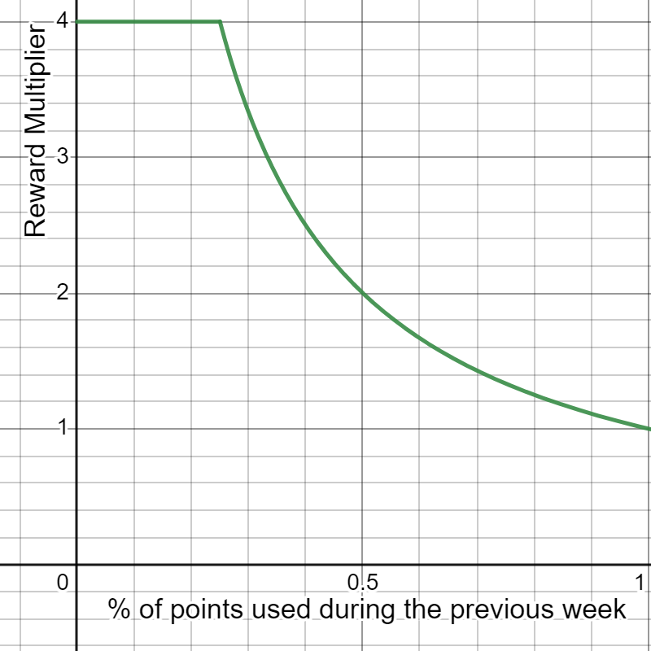

*Content Staking is currently in beta and subject to change.*

The Content Staking system has two main objectives: grow the network, and improve curation. Here, we will look at how the system functions.

Heavy inspiration was taken from the Dapp Staking system implemented on Astar Network, 
aimed at incentivizing developers to build applications on the network. 
Content Staking incentivizes creators to make posts, and users to like, share, and comment on posts that they think are high quality. 
This gives the network a signal about what content is high quality, and provides rewards for creators, which will help attract creators to Subsocial.

To participate in Content Staking, users need to lock at least 2,000 SUB [here](https://sub.id/creators). 
Once tokens are locked, a user can start liking posts 
on Subsocial, and they will receive rewards every week. Creators of the posts that a user likes will also receive rewards, 
thanking them for their great content. The more tokens a user locks, the higher their rewards will be.

Locked tokens will be subject to a roughly 7 day unlocking period. 
After the unlocking period, another transaction will be required to claim the unlocked the tokens.

## Rewards
Users with locked tokens will receive SUB rewards for each post or comment that they like in a day, 
up to a maximum of 10 per day (for a weekly total of 70, as rewards are calculated weekly). 
The creators of those liked posts will also receive rewards. Past 10 likes, a user's rewards will not increase, 
and neither will the total amount of rewards for creators. As a simple example, if Alice receives 100 SUB for liking 10 posts from 10 different creators, 
each creator will receive 10 SUB (100/10). If Alice likes 20 posts from 20 different creators, she will still receive 100 SUB, 
but each creator will only get 5 SUB (100/20).

At the moment, total staking rewards are 1,242,000 SUB per month. 45% of these rewards are allocated for stakers, 50% for creators, and 5% for applications.
These rewards are currently taken from the treasury, but may come from inflation in the future.

Rewards for creators depend on how many likes they get, and how many tokens each liker has locked. 
Likewise, rewards for applications depend on how many tokens each user has locked.

# Reward Splitting

In some circumstances, rewards may be split between multiple users.

If Alice posts in her own space, she will receive 100% of the rewards given to her post.

If Alice posts in Bob's space, Alice will receive 80% of the rewards given to her post, and Bob will receive 20%. In this case, 
maybe Bob's space has a huge amount of followers, and will provide Alice with extra exposure, ultimately rewarding her more, even though she only gets 80%.

Likewise, rewards will be split for comments and shared posts. 

- For comments, the author of the comment will receive 80%, and 20% of the rewards for the comment will go to the creator of the original post.

- For shared posts, 50% of the reward will go to the user that shared a post (and maybe added some additional text or info along with it),
and 50% will go to the original poster.

The reward splitting mechanism will help to further reward great creators, and those who increase network activity and engagement among users.

# Reward Multiplier

Staking rewards are inversely correlated to the percent of users with locked SUB that liked posts or comments during the previous week.
For example, if there are 100 users that each lock 5,000 SUB, there will be 500,000 SUB locked. If 50 users like 10 posts per day, every day during the week,
and the other 50 users like 0 posts, then only 50% of the users liked posts. This will result in a 2x reward boost for the users that did like posts (1/50%).

This multplier caps at 4x, or 25%. Using the above example, if only 20 users liked posts, and 80 did not, that would be 20%, 
yielding a multipler of 5x. However, it caps at 4x, and the users that liked posts would only receive a 4x boost to their rewards.

In reality, the multiplier is based on SUB locked, not users, as users are likely to lock different amounts of SUB, and like different amounts of posts.
If Alice locks 10,000 SUB and likes 70 posts during the week, and Bob locks 90,000 SUB and only likes 10 posts during the week, 
the calculation will look like this:

Total amount of points possible = (10,000 + 90,000) x 70 = 7,000,000

Alice's points = 10,000 x 70 = 70,000

Bob's points = 90,000 x 10 = 900,000

Combined, Alice and Bob used 970,000 points, out of a possible 7,000,000. This is only 13.85% of the total possible, 
which will give them both a 4x boost to their rewards. In this example, Alice ends up benefiting because Bob did not like a full 70 posts. Note that if Bob had liked a full 70 posts, the multiplier would be 1x, and Alice's rewards would be lower, but Bob's would be higher, even without the multiplier.

---

While Subsocial does not need staking for network validation (as it is secured by Polkadot), 
the implementation of Creator Staking will still positively benefit the network, 
by transferring token share from those are not participating in network growth, 
to those that are, as well as aiding in network curation and incentiving high quality creators.
