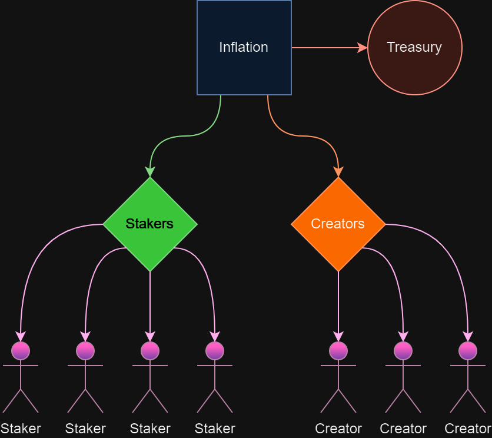

The Creator Staking system has two main objectives: grow the network, and improve curation. Here, we will look at how the system functions.

Heavy inspiration was taken from the Dapp Staking system implemented on Astar Network, 
aimed at incentivizing developers to build applications on the network.
Creator Staking expands this idea to include creators of content and communities, as those are also very valuable to Subsocial.

Token holders can stake [here](https://sub.id/creators). 
The minimum amount that users can stake is 100 SUB, and they will need to have at least 10 SUB left over after staking.

Holders of SUB tokens can to stake towards their favorite content, community, or application creators, in order to receive more tokens. 
Stakers will receive the same rewards regardless of who they stake to, effectively making this a vote, 
and improving curation by signaling to the network what is most popular with the userbase.

Creators of applications, content, and communities can register as Creators in the Creator Staking system, allowing token holders to stake towards them. 
Note that at launch, there will be a pre-selected list of 10 creators to stake towards. If you are a creator that would like to register, 
fill out this [form](https://forms.gle/aneosvJP1ntJ9Zrh6). In the future, creator registration will likely become permissionless, 
or take place through on-chain governance, though we are waiting to see how the system performs.

Creators will receive tokens based on how many SUB are staked towards them, compared to other creators. 
Of the tokens allocated to Creator Staking rewards, 66.7% will be distributed among stakers, and 33.3% will be distributed among creators.
As usual, the more tokens a user stakes, the more they can expect to receive in return, 
and a creator with one million SUB staked towards them will receive more rewards than a creator with only one thousand SUB staked towards them.

Subsocial currently has 1.58% inflation. At launch, 90% of this inflation will be allocated towards Creator Staking (the remaining 10% will go to the treasury).
This means that Creator Staking rewards will start at 1,185,000 SUB per month (395,000 split among creators and 790,000 split among stakers). 
The inflation rate and percentage of inflation that is allocated towards Creator Staking is subject to change.

Staked tokens will be subject to a roughly 7 day unbonding period in order to unstake them. 
After the unbonding period, another transaction will be required to fully unlock the tokens.

While Subsocial does not *need* staking, as it is secured by Polkadot, the implementation of Creator Staking will still positively benefit the network, 
by transferring token share from those are not participating in network growth, to those that are, 
as well as aiding in network curation and incentiving high quality creators.

