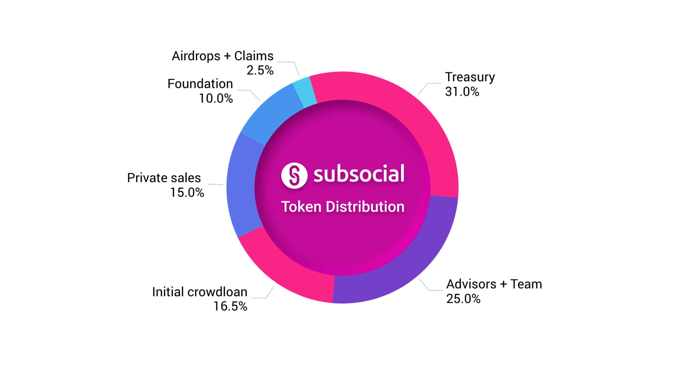

## Initial Distribution

At the launch of the Subsocial parachain, the total token supply will be 1 billion SUB, to be distributed in the following manner:

| Allocation | Tokens | Percentage | Description |
|--|--|--|--|
| Private Sales | 120,000,000 | 12% | 20% initial unlock, 80% vesting over 2 years. |
| Public Sale | 30,000,000 | 3% | 10% initial unlock, 90% vesting over 6 months. |
| Advisors & Team | 250,000,000 | 25% | 1.2% initial unlock, 98.8% vesting over 2 years. |
| Initial Crowdloan | 165,000,000 | 16.5% | For Subsocial’s initial crowdloan. Any unused tokens will be sent to the treasury. Crowdloan rewards will have a 20% initial unlock, with 80% vesting over the 48 week period of the parachain slot lease. |
| Treasury | 310,000,000 | 31% | Used for grants, hackathons, and future crowdloans. |
| Subsocial Foundation | 100,000,000 | 10% | These funds will be used to facilitate marketing efforts. 2% initial unlock, 98% vesting over 2 years. |
| Airdrops & Claims | 25,000,000 | 2.5% | Airdrops and token claims to further distribute SUB tokens among the community. 4% initial unlock (10% of The Dotsama Token Claim), 2 year vesting period (the remaining 900,000 SUB from The Dotsama Token Claim will vest sooner). |

The treasury is not included in the token release chart because it will not necessarily be circulating. 
The only way to use tokens from the treasury is to submit a treasury proposal that may or may not be approved.

## Inflation

In the future, token supply inflation will begin, and each block produced will mint more tokens as a reward for important participants of the network. 
Initial inflation will be set at 3% annually, and can be changed later via on-chain governance. 
At the time of writing, 90% of inflation is allocated towards Creator Staking rewards, and 10% towards the treasury. 
These values can be changed in the future via on-chain governance.

The parameters may be adjusted to reflect market conditions. 
The network needs to ensure that inflation doesn’t negatively impact the utility of existing tokens, 
but is sufficient to reward certain important participants, such as collators, for performing necessary functions.

Before inflation begins, a distribution split will be determined, to decide what percentage of inflation goes to collators, dapp stakers, etc. 
This distribution split will be under the control of on-chain governance and will be able to be changed.

It is important to note that as long as token holders can beat inflation by staking, 
inflation is not a problem, and is actually beneficial, as it incentivizes network security.
