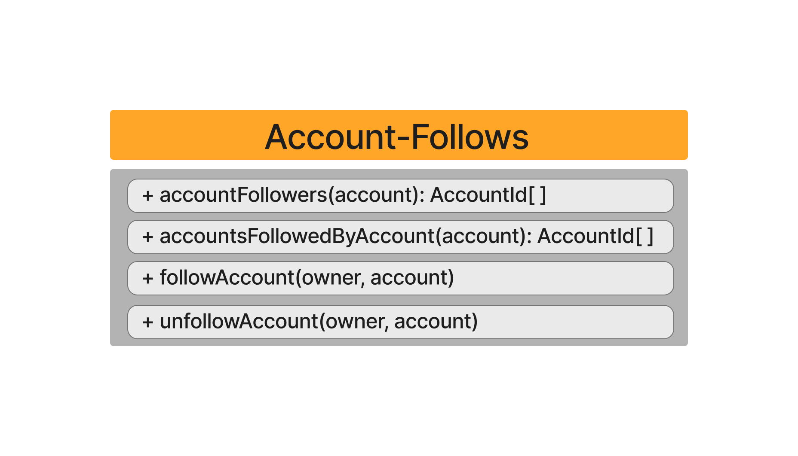

Follows enable users to have a relation with specific profiles and/or spaces, having them in their content feed. A Follow will establish a connection between users and each one will have its own social graph. If you want to leave a space simply because it doesn't interest you, you can unfollow it.

Here you can have an overall vision of what Follows allow:

