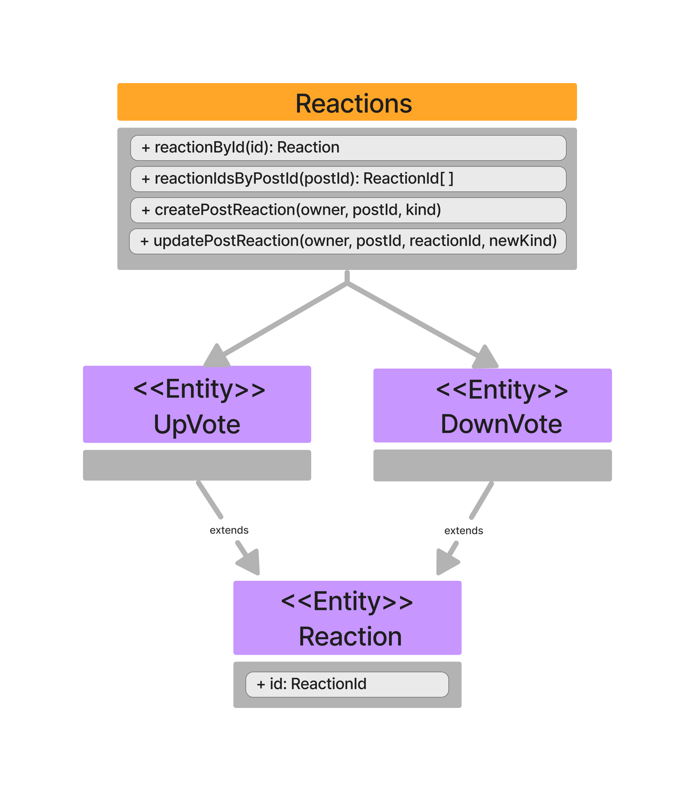

Reactions enable the ability of reacting posts and comments, through upvotes and downvotes.
Upvotes and Downvotes are essentially extensions of a reaction and are identified by a unique identifier.

Here you can have an overall vision of what Reactions allow:

