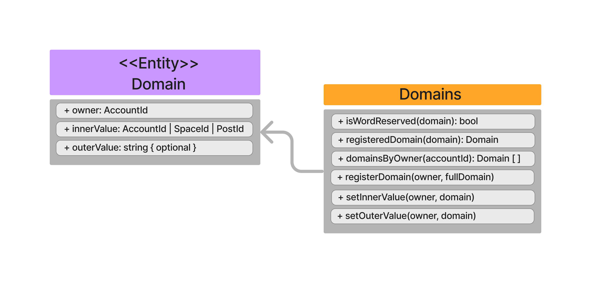

Usernames are crucial for social network dApps because they enable the mapping of human-readable usernames onto account addresses. They basically create an alias for an account. There can be an inner value and an outer value. The inner value can be a Space, Account or Post. The second can be anything, usually a string that represents a URL identifying a user in a web site.

Here you can have an overall vision of what Usernames allow:

