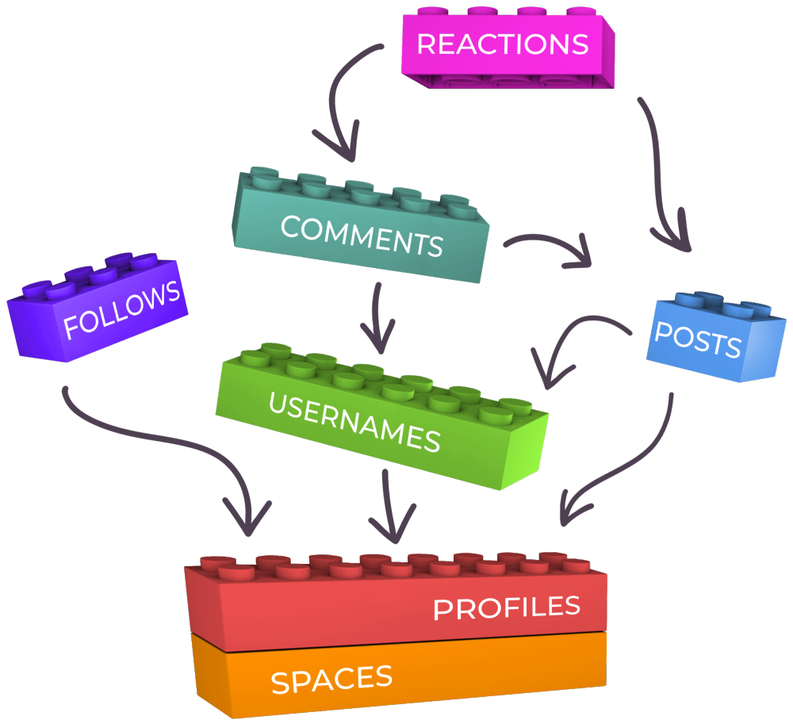

**The following section covers how Subsocial entities are structured and their interaction**

In order to have an understanding of the SDK it is not necessary to know the implementation of the substrate based pallets that compose Subsocial. However, understanding the relations between Subsocial entities can help you build within the SDK.

Subsocial uses the following building blocks to enable social networking:

- Spaces
- Profiles
- Posts and Comments
- Reactions
- Follows
- Usernames
