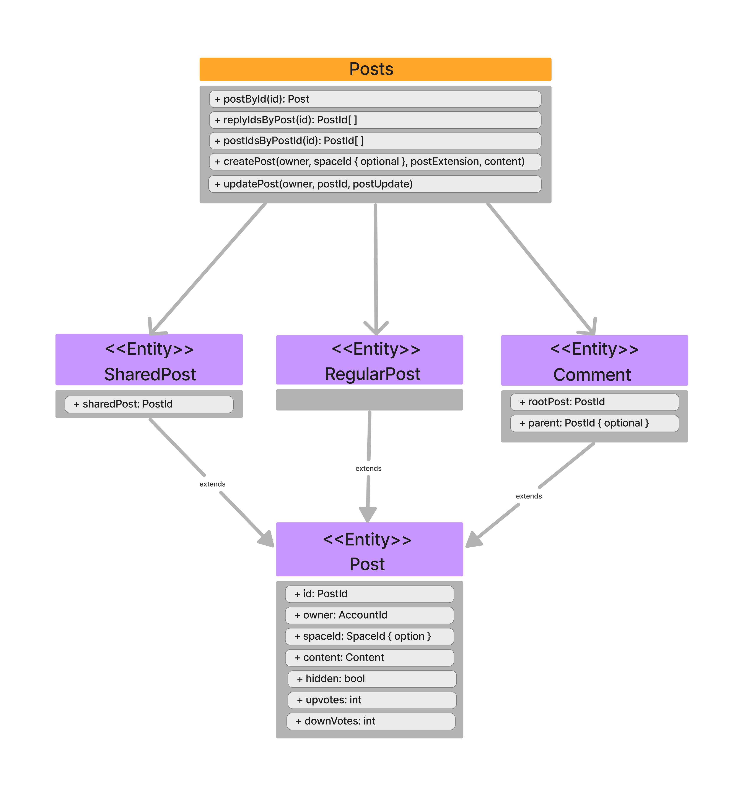

Posts and Comments are the building blocks that allow you to store content on Subsocial(whether that is text, audio, an image, or a video).

Posts live inside spaces and are the way users can interact and share content with each other. Posts can be commented and reacted, have upvotes and downvotes, and be shared across different Spaces.

Comments are just an extension of Posts and serve to add content under a specific post. These inherit all Posts properties, enabling reactions and so on. Basically comments are just posts that have one or more parents.
There are different extensions for Posts: Shared Posts, Regular Posts and Comments.

Here you can have an overall vision of what Posts allow:

