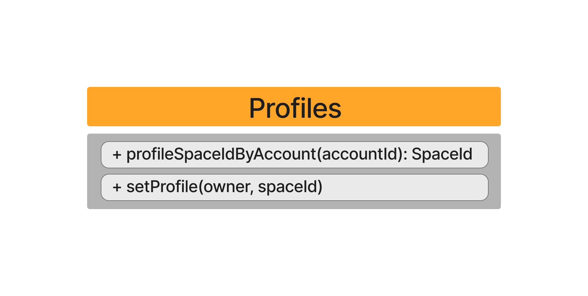

A profile is nothing more than a space associated with a user, so the process of authentication is easier across multiple dApps. A Profile holds a user's name, bio, picture and all data related to a user.
In order to set a profile with a space you need to be the owner of the space you want to associate.
Any space can be used to set a profile.

Here you can have an overall vision of what Profiles allow:

