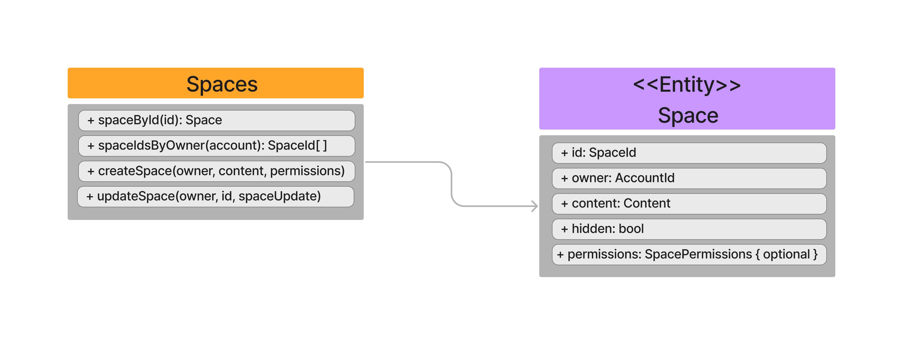

A space is the basic building block for Subsocial, it is where content lives. All posts must be made inside of a Space, like folders hold files in a file system. Different concepts can be represented through a Space, such as communities, channels, chats, a user's personal blog and so on.
Each Space is owned by an account, but can potentially be distributed to multiple owners. The owner of a space is able to moderate the Space, change its set up, enabling or disabling certain actions. In summary, ​​think of a space like a Twitter page, Telegram channel, or Medium publication.

Here you can have an overall vision of what Spaces allow:

