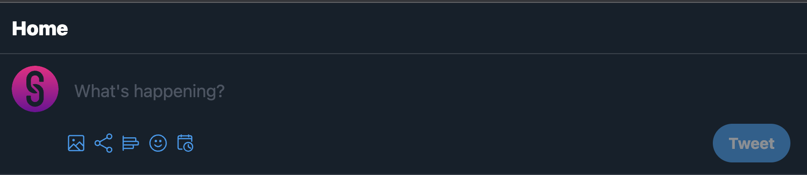

Let's design the UI for homescreen with tweets list. 

### Setup

#### Installing
First we need to install a few more packages for the home screen:

```sh
  yarn add react-list react-contenteditable
```

#### React Components

Follow the steps to add the UI:

1. Create a new file inside **src/components** directory, with name **tweet-box.tsx**. And add the following code for tweet box:


  

  ```tsx
    import ContentEditable, { ContentEditableEvent } from 'react-contenteditable';
    import { useState } from 'react';
    import { ReactComponent as Share } from '../svgs/share.svg'
    import { ReactComponent as Gallery } from '../svgs/gallery.svg'
    import { ReactComponent as Poll } from '../svgs/poll.svg'
    import { ReactComponent as Emoji } from '../svgs/emojis.svg'
    import { ReactComponent as Schedule } from '../svgs/schedule.svg'

    const TweetBox: React.FC = () => {
      const [tweetData, setTweet] = useState('');

      const onTweetBtnClick = async () => {
        setTweet('')
      }

      const updateTweetData = async (e: ContentEditableEvent) => {
        setTweet(e.target.value);
      };
      return (
        <div>
          <div className="px-3 pt-3 pb-2 flex flex-wrap">
            <a className="flex-shrink-0 h-12 w-12">
              <div className="relative">
                <div className="absolute anim left-0 right-0 top-0 bottom-0 z-10 hover:bg-black rounded-full hover:bg-opacity-15"></div>
                
              </div>
            </a>
            <div id="tweet-box" className="flex-grow px-2 pt-3 pb-1 relative">
              <div className="px-2">
                <div className="pointer-events-none absolute text-gray-600 max-h-full text-lg">
                  {tweetData.length === 0 && "What's happening?"}
                </div>

                <ContentEditable
                  aria-multiline="true"
                  aria-autocomplete="list"
                  aria-describedby="tweet-box"
                  spellCheck
                  tagName="div"
                  className="text-white text-lg w-full focus:outline-none select-text whitespace-pre-wrap break-all inline-block"
                  onChange={updateTweetData}
                  html={tweetData}></ContentEditable>
              </div>
              <div className="flex flex-wrap justify-between mt-5">
                <div className="flex items-center">
                  <button style={{ marginRight: 8 }}>
                    <Gallery height="20px" width="20px" color='rgb(29, 155, 240)' />
                  </button>
                  <button style={{ marginRight: 8 }}>
                    <Share height="20px" width="20px" color='rgb(29, 155, 240)' />
                  </button>
                  <button style={{ marginRight: 8 }}>
                    <Poll height="20px" width="20px" color='rgb(29, 155, 240)' />
                  </button>
                  <button style={{ marginRight: 8 }}>
                    <Emoji height="20px" width="20px" color='rgb(29, 155, 240)' />
                  </button>
                  <button style={{ marginRight: 8 }}>
                    <Schedule height="20px" width="20px" color='rgb(29, 155, 240)' />
                  </button>
                </div>
                <div className="">
                  <button
                    onClick={onTweetBtnClick}
                    disabled={tweetData.length === 0}
                    className={`text-white px-4 py-2 shadow-sm focus:outline-none font-bold bg-primary rounded-full ${tweetData.length === 0 ? 'cursor-not-allowed opacity-50' : ''
                      }`}>
                    Tweet
                  </button>
                </div>
              </div>
            </div>
          </div>
          <div className="h-2 bg-gray-100 w-full bg-opacity-15"></div>
        </div>
      );
    };

    export default TweetBox;
  ```

2. Now, let's create the UI of a tweet. Create a new file inside **src/components** directory, with name **tweet.tsx**. Paste the following code for UI:

  ```tsx
    import { ReactComponent as ArrowDown } from '../svgs/arrow-down.svg';
    import { ReactComponent as Replies } from '../svgs/replies.svg';
    import { ReactComponent as Retweet } from '../svgs/retweet.svg';
    import { ReactComponent as Share } from '../svgs/share.svg';
    import { ReactComponent as Heart } from '../svgs/heart.svg'

    export interface ITweet {
      id?: string;
      avatar?: string;
      username?: string;
      name?: string;
      description?: string;
      assets?: { type: string; url: string }[];
      replies?: number;
      retweets?: number;
      likes?: number;
      date?: string | Date;
    }

    const TweetComponent: React.FC<ITweet> = props => {

      return (
        <div className="flex cursor-pointer hover:bg-dark-lighter p-3 anim border-b border-gray-100 border-opacity-15">
          <a className="flex-shrink-0 h-12 w-12 pt-1">
            <div className="relative">
              <div className="absolute anim left-0 right-0 top-0 bottom-0 z-10 hover:bg-black rounded-full hover:bg-opacity-15"></div>
              
            </div>
          </a>
          <div className="flex-grow px-3 pb-1 relative">
            <div className="flex">
              <div className="flex flex-grow flex-wrap items-center">
                <div>
                  <span className="text-white font-bold mr-1 cursor-pointer hover:underline">
                    {props.name?.slice(0, 5) + '...' + props.name?.slice(props.name.length - 4)}
                  </span>
                  <span className="text-gray-600">
                    {props.username} . {props.date?.toString()}
                  </span>
                </div>
              </div>
              <button className="text-white rounded-full anim px-1 py-1 hover:bg-primary hover:bg-opacity-15 focus:bg-opacity-50 focus:outline-none">
                <ArrowDown color="white" height="20px" width="20px" />
              </button>
            </div>
            <div className="pr-1">
              <span
                className="text-white"
                dangerouslySetInnerHTML={{ __html: props.description || '' }}></span>
              <div className="mt-3 flex-wrap flex">
                {props.assets?.map((file, idx) => (
                  <div
                    key={idx}
                    className={`rounded-lg overflow-hidden border border-gray-100 border-opacity-15 ${props.assets && props.assets.length > 1 ? 'w-full lg:w-1/2' : 'w-full'
                      }`}>
                    
                  </div>
                ))}
              </div>
            </div>
            <div className="flex mt-3">
              <div className="text-gray-500 select-none hover:text-primary anim flex items-center">
                <Replies color="white" height="20px" width="20px" />
                <span className="ml-3 text-xs">{props.replies}</span>
              </div>
              <div className="text-gray-500 select-none hover:text-green-600 anim flex items-center">
                <Retweet color="white" height="20px" width="20px" />
                <span className="ml-3 text-xs">{props.retweets}</span>
              </div>
              <div className="text-gray-500 select-none hover:text-pinkish anim flex items-center">
                <Heart color="white" height="20px" width="20px" />
                <span className="ml-3 text-xs">{props.likes}</span>
              </div>
              <div className="text-gray-500 select-none  hover:text-primary anim flex items-center">
                <Share color="white" height="20px" width="20px" />
              </div>
            </div>
          </div>
        </div>
      );
    };

    export default TweetComponent;

  ```


3. Create a new file inside **src/screens** directory, with name **home.tsx**. Paste the following code for UI:

  ```tsx
  import { useState } from "react";
  import ReactList from 'react-list'
  import TweetBox from "../components/tweet-box";
  import TweetComponent, { ITweet } from "../components/tweet";
  import Logo from '../svgs/logo.svg';

  const HomeScreen = () => {

    const [tweets, setTweets] = useState<ITweet[]>([])

    return (
      <div className="flex">
        <div className="flex flex-1 items-center justify-center">
          <div className="w-full lg:w-1/2a">
            <div className="p-3 border-b border-white border-opacity-15 sticky top-0 bg-dark z-50 flex">
              <span className="text-white text-xl font-extrabold ml-10">Home</span>
            </div>
            <TweetBox />
            <div>
              <ReactList
                type="variable"
                axis="y"
                length={tweets.length}
                itemRenderer={(idx: any, key: any) => <TweetComponent key={key} {...tweets[idx]} />}
              />
            </div>
          </div>
        </div>
      </div>
    );
  }

  export default HomeScreen
  ```

