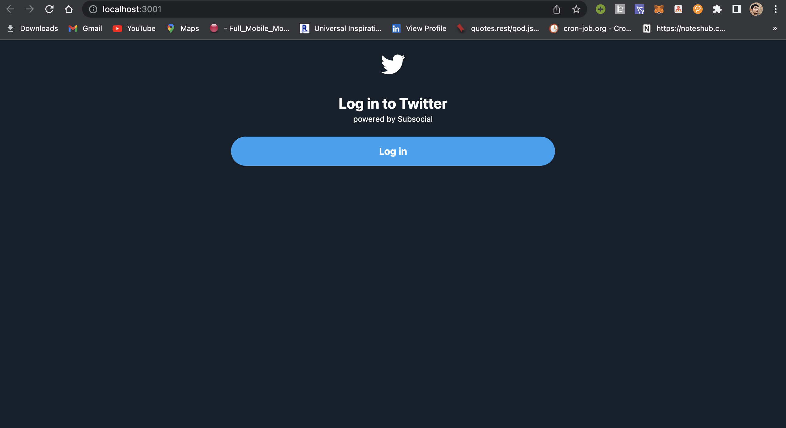

Now, let's first write the login / signup screen. 

In web3, user authentication is done via wallets. In this case, we will be using the [Polkadot.js](https://polkadot.js.org/extension/) wallet extension.

This is how it looks:



### Creating the login screen UI

Follow the steps to create this login screen: 

1. Create a new file with the name `login.tsx` inside a new directory **screens** in the `src` folder.

2. Paste the following content: 

```tsx
import Logo from '../svgs/logo.svg';

type LoginScreenProps = {
  onLoginClick: () => void
}

const LoginScreen = ({ onLoginClick }: LoginScreenProps) => {

  return (
    <div className="flex flex-col justify-center  container mt-5 text-white mx-auto">

      <div className='flex flex-1 justify-center'>
        
      </div>

      <span className="font-bold text-2xl mt-6 pt-1 text-center">Log in to Twitter</span>
      <small className="text-center">powered by Subsocial</small>
      <div className=" lg:w-5/12 lg:px-0 px-5 w-full mt-5 mx-auto">
        <button
          onClick={onLoginClick}
          type="submit"
          className={`bg-primary focus:outline-none font-bold hover:bg-primary-hover text-white rounded-full w-full py-3`}>
          Log in
        </button>
      </div>
    </div>
  );
}

export default LoginScreen
```

3. [Download](https://drive.google.com/drive/folders/1l6t06P1aJqTCM7vi5rU6qIhwxeHc3_WR?usp=sharing) the `svgs` and save the directory inside the `src` folder (if it's not there already).


### Connecting to the wallet

For connecting the web app to the wallet, we need to do 2 things:

- Use the methods provided by the Subsocial Starter to connect to the wallet
- Saving / Fetching selected the wallet address to localstorage


#### Fetching a list of all accounts

Update the **App.tsx** file above the return statement like this, and clear everything else:

```tsx
const ACCOUNT_STORAGE_KEY = 'connected_account'

const App = () => {

  const [account, setAccount] = useState<string | null>(localStorage.getItem(ACCOUNT_STORAGE_KEY))

  const connectWallet = async () => {
    const accounts = await polkadotjs.getAllAccounts()
    console.log('List of all accounts:', accounts)

    // Store the first account address.
    if (accounts.length > 0) {
      localStorage.setItem('connected_account', accounts[0].address)
      setAccount(accounts[0].address)
    } else {
      alert('No accounts found in polkadotjs wallet.')
    }
  }

  return ...
}
```

#### Rendering the UI conditionally

Now, we have to make sure that the login screen UI is rendered conditionally.

```tsx
const App = () => {
  ...

  if(account) {
    // User is already logged-in.
    return <div> </div>;
  }

  return <LoginScreen
    onLoginClick={connectWallet}
  />
}
```

:::info Note
Make sure to add all required imports suggested by the text editor. 

The **...** represents code part covered in previous steps.
:::

