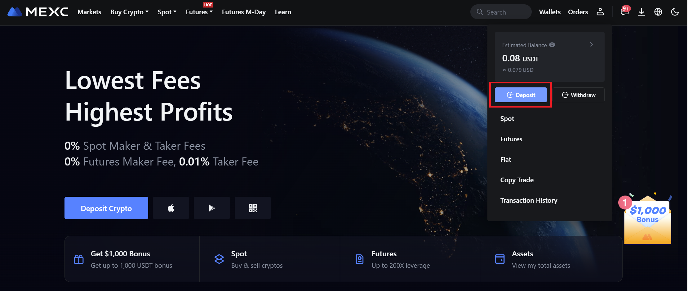
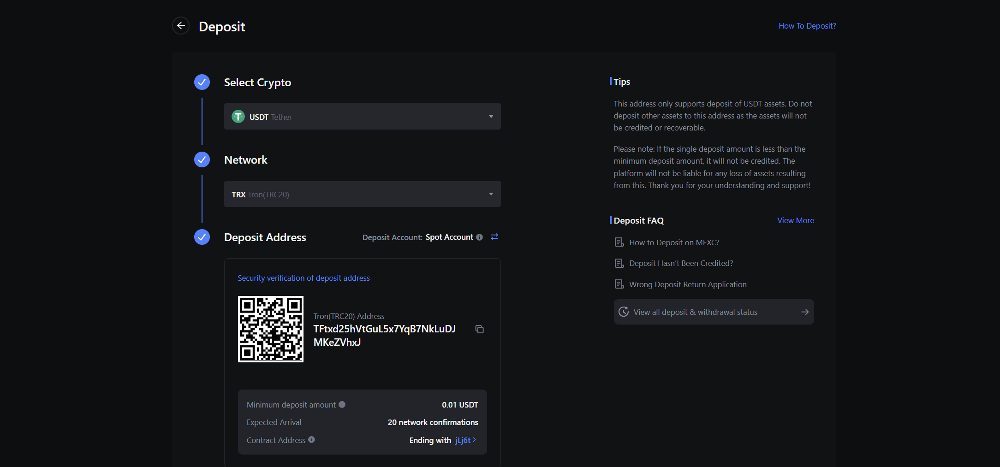
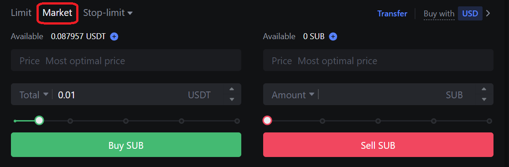
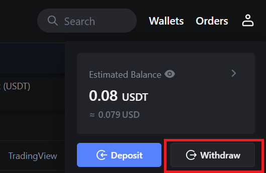
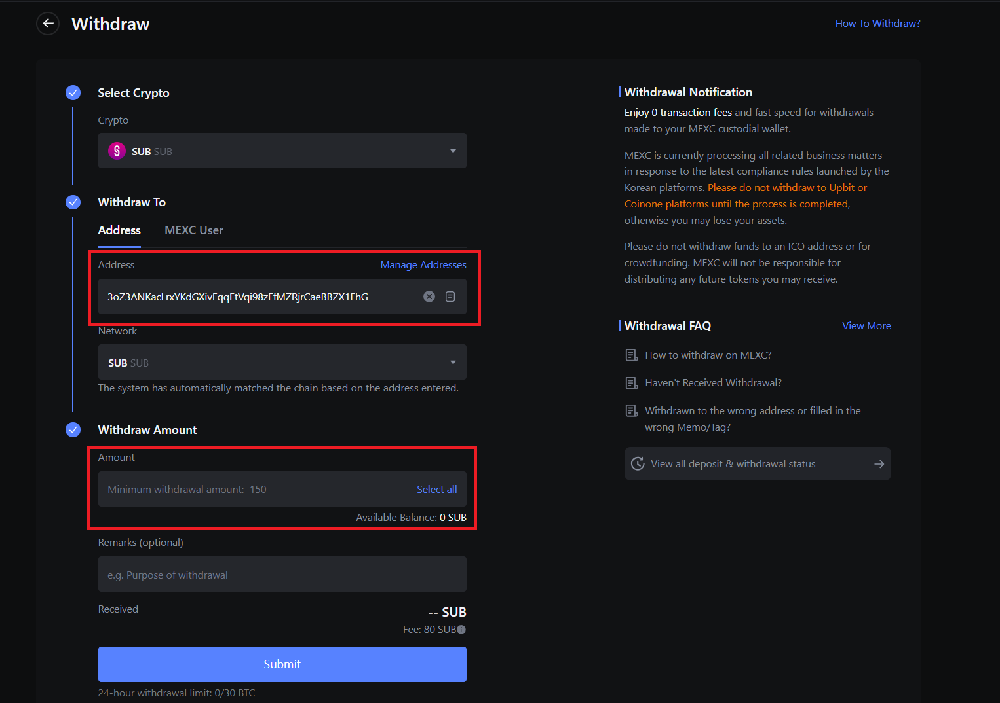

MEXC is one of the easiest ways for newcomers to get SUB, as it allows you to use any of the other many tokens traded on MEXC to get SUB.

Here is a short video tutorial showing how to get started on MEXC, 
or you can continue reading for a written tutorial.

1. Visit [MEXC](https://www.mexc.com/) to create an account.

2. Once you are logged in, find the Deposit button.

3. Select the token you want to deposit and the network it will be deposited on. This is the token that you want to use to swap for SUB.
Generate the address, and deposit your tokens into MEXC from another exchange or one of your own wallets.

4. Go to the Spot tab at the top, and then select the Spot option. Next, search for SUB,
or follow this link to go to the [SUB/USDT trading page](https://www.mexc.com/exchange/SUB_USDT).

5. Scroll down a bit to the trading window, switch it to Market, and enter how much SUB you would like to receive.

6. After the trade is completed, go to the [Withdraw page](https://www.mexc.com/assets/withdraw/SUB).

7. Enter your SUB wallet address and the amount of SUB you want to withdraw, click submit, and follow the prompts.

With your SUB tokens on Subsocial, you can participate in [Content Staking](https://sub.id/creators), 
register a [Subsocial Username](https://polkaverse.com/dd) to establish an identity, 
generate [energy](https://polkaverse.com/energy) to have lower transaction fees, 
and get started creating content on [PolkaVerse](https://polkaverse.com/)!
