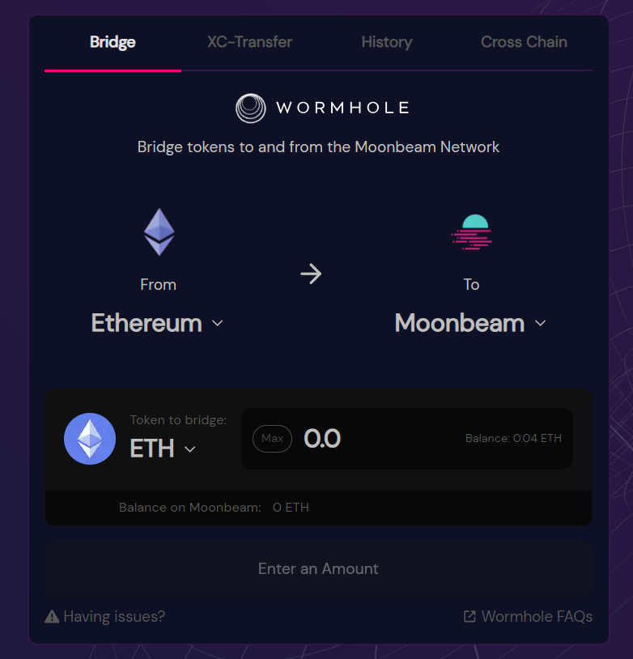
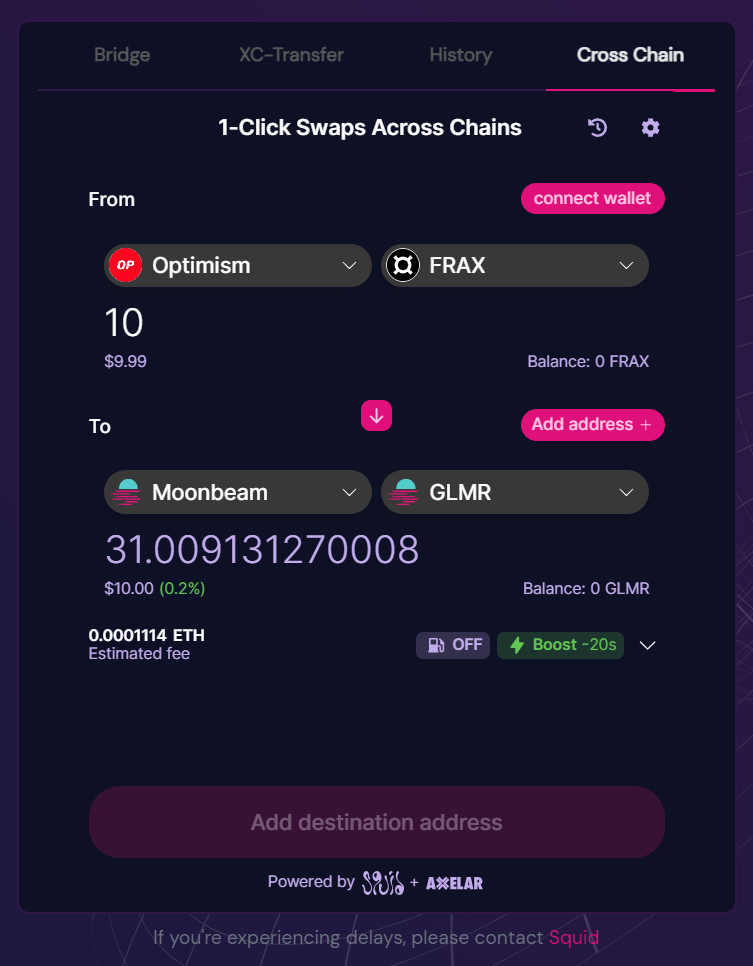
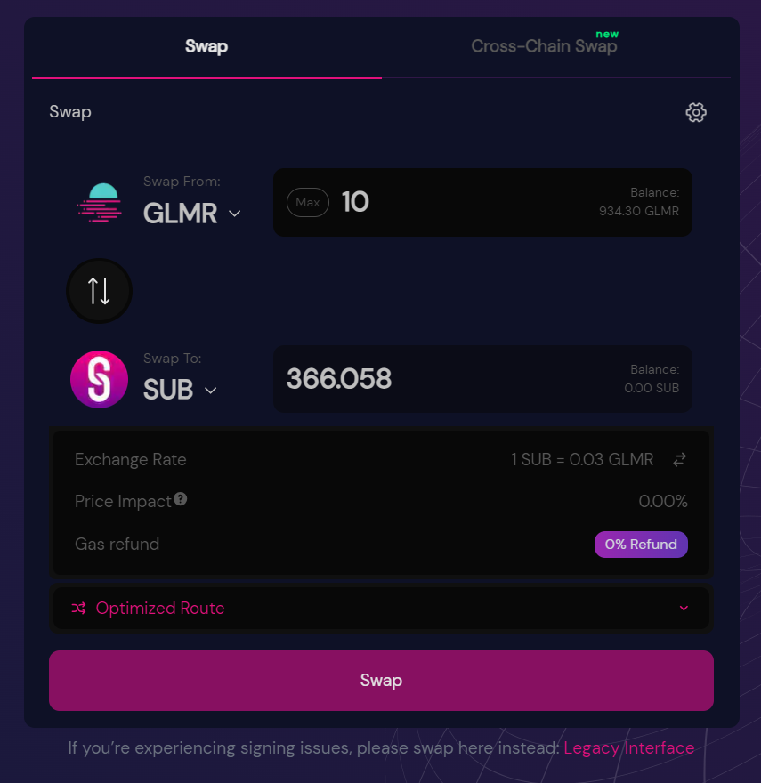
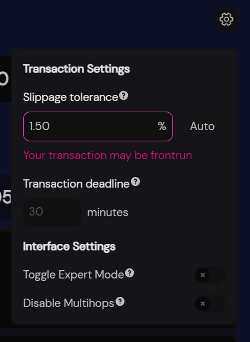
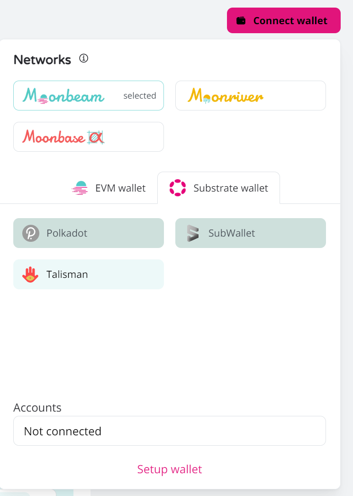
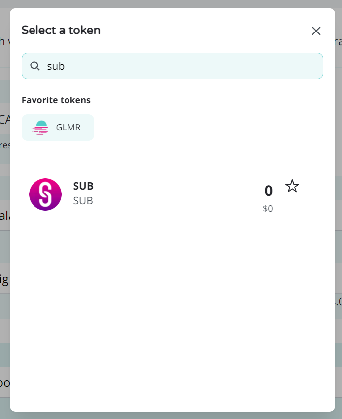
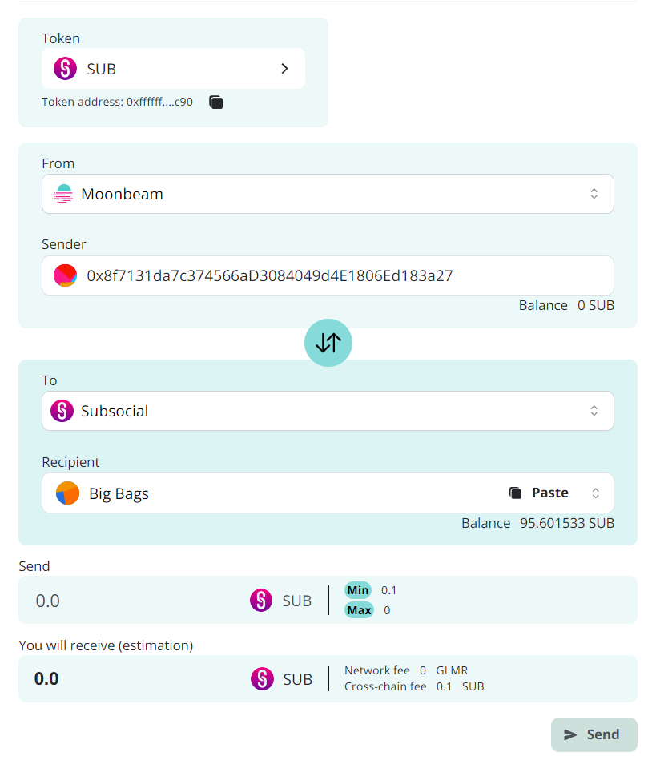

Thanks to StellaSwap, it's super easy to get SUB tokens! All you'll need is an EVM-compatible wallet like [Talisman](https://talisman.xyz/), 
[SubWallet](https://www.subwallet.app/), or [Metamask](https://metamask.io/), and some tokens on Moonbeam 
(you will need a Polkadot compatible wallet to use Subsocial, so we recommend using Talisman or SubWallet over Metamask).

1. If you already have tokens on Moonbeam, you can skip this step. Otherwise, you have two options:

Option 1: If you have tokens on Ethereum, you can visit StellaSwap's [bridge](https://app.stellaswap.com/bridge) page to 
transfer tokens from Ethereum to Moonbeam, and them swap them.

Option 2: You can use StellaSwap's [cross-chain swap](https://app.stellaswap.com/bridge/cross-chain) page to transfer 
and swap tokens from 60+ chains to something like GLMR on Moonbeam (at the time of writing, cross-chain swapping to SUB is not yet available). Swapping to GLMR is advisable as you will need some anyways for transaction fees on Moonbeam.

2. Now that you have tokens on Moonbeam, head to StellaSwap's [swap page](https://app.stellaswap.com/exchange/swap) to get SUB tokens!

4. If you are doing a particularly large swap, you may need to click the gear icon in the top right corner and increase the slippage tolerance.

5. After the swap completes, go to Moonbeam's [Cross-chain page](https://apps.moonbeam.network/moonbeam/xcm) and connect
both your EVM wallet and Polkadot wallet.

6. Select SUB as the token to transfer (you may have to type it in the search field).

7. Make sure you are transfering in the correct direction (Moonbeam to Subsocial), enter the amount of SUB to transfer, click Send, and wait a few seconds!

With your SUB tokens on Subsocial, you can participate in [Content Staking](https://sub.id/creators), 
register a [Subsocial Username](https://polkaverse.com/dd) to establish an identity, 
generate [energy](https://polkaverse.com/energy) to have lower transaction fees, 
and get started creating content on [PolkaVerse](https://polkaverse.com/)!
