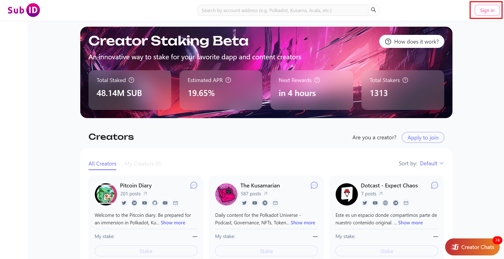
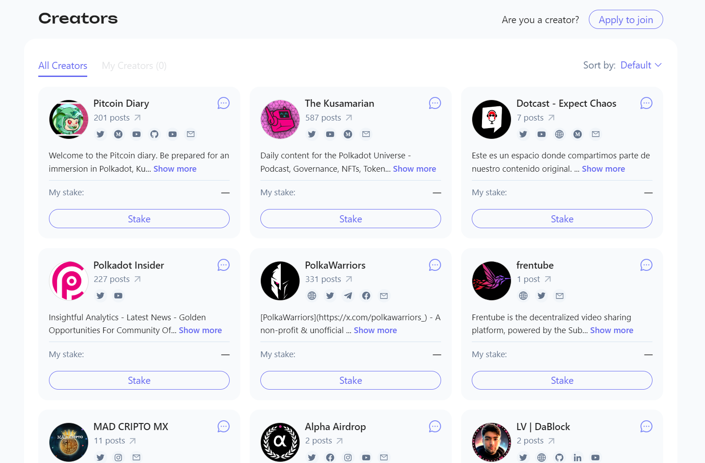
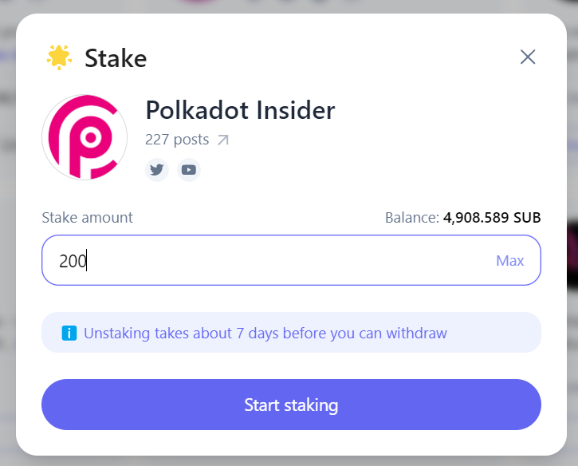

Supporting your favorite creators is easier than ever with Subsocial's [Creator Staking](https://docs.subsocial.network/docs/basics/staking/overview) system!

To start staking, you will need some SUB tokens. If you don't have any, here is a short tutorial 
on how to [get SUB](https://docs.subsocial.network/docs/tutorials/GetSUB/get-sub).

To start staking, head over to the [Creator Staking](https://sub.id/creators) page on Sub.ID, and sign in.

With your wallet connected, it's time to look through the registered creators and find your favorites. Remember, you can stake to more than just one creator! 
Once you find a creator that you want to stake to, click on the Stake button on their card.

Next, enter the amount of SUB that you want to stake to that creator. **Keep in mind that unstaking will take 7 days.**

After staking, you'll be awarded with more tokens roughly every 24 hours as a reward for helping to curate the network and signal which creators are the best! 
Once rewards are distributed, you can claim and stake them too!
