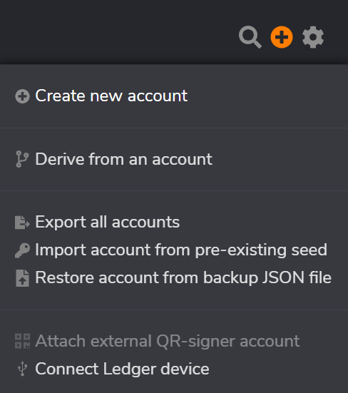
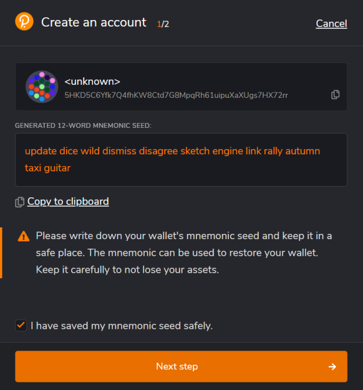
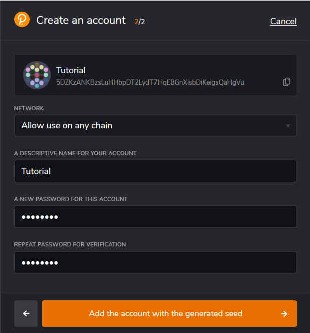

## Creating An Account
***Note:** It is recommended to read the rest of the steps on how to create an account, and then create an account. 
If you click off of the extension during the creation process, it will close and you will have to start over.*

To create an account with the Polkadot.js extension, you need to:
1. Click the + button in the top right corner
2. Click “Create new account”

On the next screen, 12 words in order will be shown. These 12 words make up your mnemonic seed phrase, and provide access to your account. 
**Store these, *in the correct order*, somewhere safe** (for more information on storing your seed properly, 
[read the wiki here](https://wiki.polkadot.network/docs/learn-account-generation#storing-your-key-safely)).

1. Create a copy of the 12 words somewhere safe and secure
2. Check the box at the bottom that says “I have saved my mnemonic seed safely.”

***NOTE:** Your seed phrase will grant anyone access to your account, and all funds held in it. 
Losing your seed phrase can prevent you from being able to recover your account. 
If your seed phrase is stolen, the thief will be able to take all of the funds from your account.*

On the next page, you can define some settings for your account. 
1. For Network, we recommend leaving it on “Allow use on any chain” 
(*Advanced users seeking more security can create individual accounts for each chain, but this complicates the user experience, and can be confusing.*)
3. Set a descriptive name for the account
4. Create a strong password

Congratulations, you now have a Substrate account. What that means will be explained in the next section.
